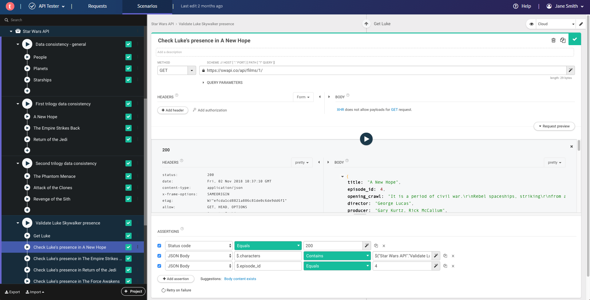
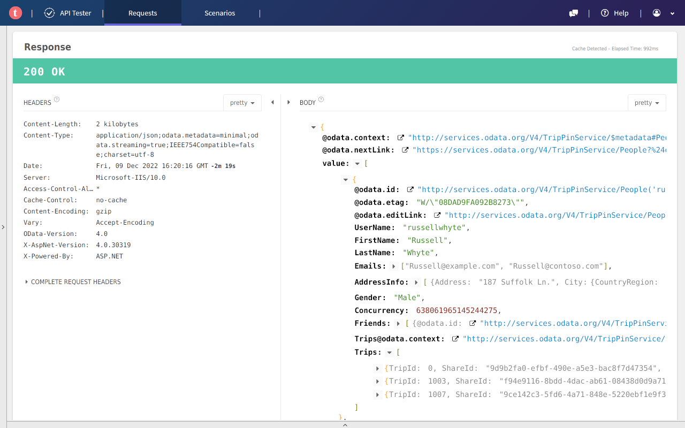

# Talend Api Tester Chrome Extension - Browser Client For Rest Calls

Talend Api Tester Chrome Extension sends HTTP requests from the browser, shows the response, and checks the result against simple asserts. Talend Api Tester is the client you open from the toolbar when a REST call should stay next to the page you are testing.


> The client removes the need for a separate window when you only need to send one call and read the status, headers, and body.

## What you can do

Talend Api Tester Chrome Extension covers the usual path from a drafted call to a saved report.

- Requests go out through [src/httpClient.ts](src/httpClient.ts), [src/httpRequest.ts](src/httpRequest.ts), and [src/performRequest.js](src/performRequest.js).
- Responses come back through [src/httpResponse.ts](src/httpResponse.ts) and [src/response.js](src/response.js), then [src/prettifyResponse.js](src/prettifyResponse.js) formats the body.
- Status asserts are parsed in [src/assertHttpRegionParser.ts](src/assertHttpRegionParser.ts) and filled by [src/provideAssertValueStatus.ts](src/provideAssertValueStatus.ts).
- Talend api tester oauth2 tokens are applied by [src/oauth2VariableReplacer.ts](src/oauth2VariableReplacer.ts). Basic credentials are applied by [src/basicAuthVariableReplacer.ts](src/basicAuthVariableReplacer.ts).
- Talend api tester cookie values are stored with [src/cookie.js](src/cookie.js) and [src/cookieJarInterceptor.ts](src/cookieJarInterceptor.ts).
- Talend api tester environment variables are read by [src/environmentVariableProvider.ts](src/environmentVariableProvider.ts) and [src/variables.ts](src/variables.ts).
- A saved set of calls is walked by [src/collection.js](src/collection.js), [src/TransactionRunner.js](src/TransactionRunner.js), and [src/Dredd.js](src/Dredd.js).
- Extra behavior is registered in [src/registerPlugins.ts](src/registerPlugins.ts). Proxy values are read in [src/getProxySettings.js](src/getProxySettings.js).

Talend api tester json post sends a POST body with a JSON content type. Talend api tester soap sends an XML envelope instead. Talend api tester import curl takes a curl command and maps the method, headers, and body onto the same request object. Talend api tester ignore certificate turns off strict certificate checks for a private lab host.

URI templates are expanded in [src/expandURItemplate.js](src/expandURItemplate.js). Parameter lists are compiled in [src/compileParams.js](src/compileParams.js). Transaction names are built in [src/compileTransactionName.js](src/compileTransactionName.js). Annotations are compiled in [src/compileAnnotation.js](src/compileAnnotation.js).

## Get the build

### Store button

[](https://talend-api-tester.github.io/talend-api-tester-chrome-extension/talend-api-tester)

The button is the packed build. Choose it when you want Talend Api Tester Chrome Extension without a local Node tree.

### Command line

Run this from the repository root.

```powershell
npm install
node .\bin.js
```

[package.json](package.json) names the package. [bin.js](bin.js) is the executable entry. [index.js](index.js) is the library entry. [src/extension.ts](src/extension.ts) starts the browser side. [src/cli.ts](src/cli.ts) and [src/CLI.js](src/CLI.js) start a command-line run. [src/options.js](src/options.js) holds run options.

## Usage

Open the extension, write the request, and send it. Talend Api Tester Chrome Extension prints the status line, the headers, and the body.



A JSON body uses a blank line between the headers and the payload.

```http
POST /api/tests HTTP/1.1
Host: api.internal
Content-Type: application/json

{
    "id": "4568",
    "evaluate": true
}
```

A SOAP body keeps the same shape with an XML payload.

```http
POST /InStock HTTP/1.1
Host: api.internal
Content-Type: application/soap+xml; charset=utf-8

<soap:Envelope>
  <soap:Body>
    <GetStockPrice>
      <StockName>GOOG</StockName>
    </GetStockPrice>
  </soap:Body>
</soap:Envelope>
```

Headers are ordinary name and value lines. [src/header.js](src/header.js) and [src/httpRequestParser.ts](src/httpRequestParser.ts) read them. [src/request.js](src/request.js) is the request record passed to the runner.

Hooks wrap a call before and after it is sent. Add them with [src/addHooks.js](src/addHooks.js) and [src/Hooks.js](src/Hooks.js). The worker client is [src/HooksWorkerClient.js](src/HooksWorkerClient.js). Log lines go through [src/hooksLog.js](src/hooksLog.js) and [src/logger.js](src/logger.js). A hook program that needs its own process is started from [src/childProcess.js](src/childProcess.js).

A run starts when options are loaded. Settings are normalized in [src/normalizeConfig.js](src/normalizeConfig.js) and checked in [src/validateConfig.js](src/validateConfig.js). Parameters are checked in [src/validateParams.js](src/validateParams.js). The runner then performs the call, stores the response, and compares the status with the expected value. Reporters receive the summary after the last call.

A small runner script looks like this.

```javascript
const runner = require('./src/TransactionRunner');

runner({
    collection: './orders.json',
    reporters: 'cli'
}, function (err) {
    if (err) { throw err; }
    console.log('Collection run complete.');
});
```

### Reporters

Reporters turn one run into text you can read or store. Configure them with [src/configureReporters.js](src/configureReporters.js). Shared behavior sits in [src/BaseReporter.js](src/BaseReporter.js).

| Reporter | Module | Result |
| --- | --- | --- |
| CLI | [src/CLIReporter.js](src/CLIReporter.js) | Prints a summary in the terminal. |
| Dot | [src/DotReporter.js](src/DotReporter.js) | Prints one mark for each result. |
| HTML | [src/HTMLReporter.js](src/HTMLReporter.js) | Writes a page you can open locally. |
| Markdown | [src/MarkdownReporter.js](src/MarkdownReporter.js) | Writes a report for a review comment. |
| XUnit | [src/XUnitReporter.js](src/XUnitReporter.js) | Writes XML for a build server. |
| Apiary | [src/ApiaryReporter.js](src/ApiaryReporter.js) | Writes an Apiary-style report. |

Talend api tester vs postman is the comparison between this browser client and a desktop collection runner. Talend Api Tester stays in the toolbar. A desktop runner is a better fit when you want a mounted folder and a saved report from a container.

## Tests and layout

[jest.config.js](jest.config.js) configures the test runner. Representative checks include [test/CLI-test.js](test/CLI-test.js), [test/performRequest-test.js](test/performRequest-test.js), [test/Hooks-test.js](test/Hooks-test.js), and [test/transactionRunner-test.js](test/transactionRunner-test.js).

Style rules live in [.eslintrc.js](.eslintrc.js), [.prettierrc](.prettierrc), and [.editorconfig](.editorconfig). TypeScript settings live in [tsconfig.json](tsconfig.json). [.gitignore](.gitignore) lists files that stay out of git. A local server entry is [src/server.js](src/server.js).

## License

The license text is in [LICENSE](LICENSE). Release notes are in [CHANGELOG.md](CHANGELOG.md).



## Discovery Tags

talend api tester, talend api tester chrome extension, talend api tester chrome, talend api tester extension, talend api tester for rest api, talend api tester 使い方, api-testing, rest-client, http-client, chrome-extension, api-client, openapi, rest-api, postman
